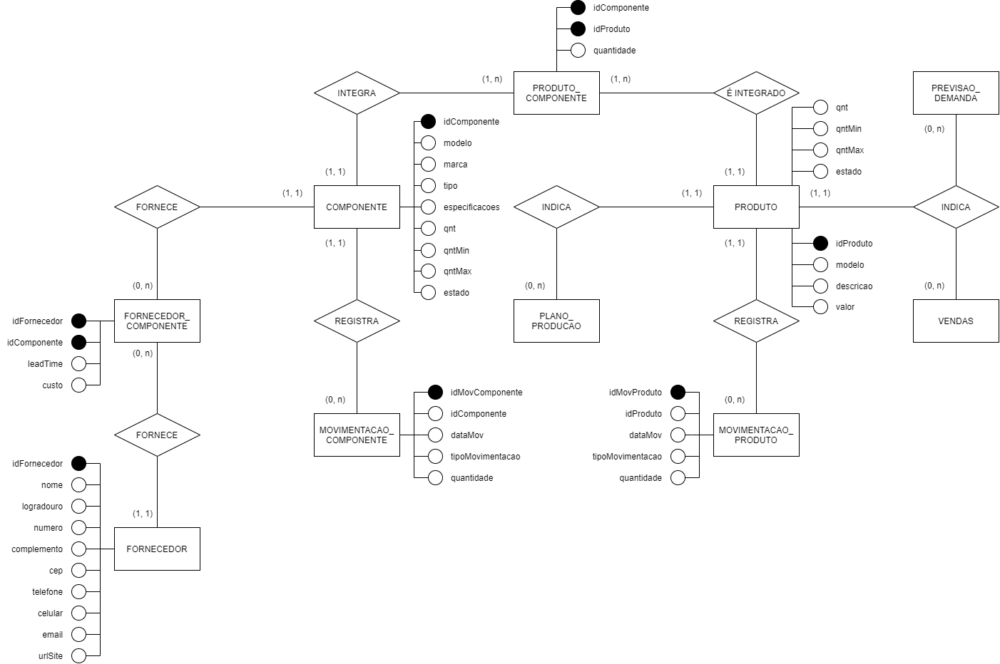

# Documentação do software

## Banco de Dados

O diagrama conceitual do banco de dados pode ser editado no [draw.io](https://drive.google.com/file/d/1Osa6yVVakydZdrjoDk_B6aDAUmRGft-i/view?usp=sharing), ainda faltam alguns atributos, que a minha inteligência fosca não permite inferir, qualquer contribuição é bem-vinda.

