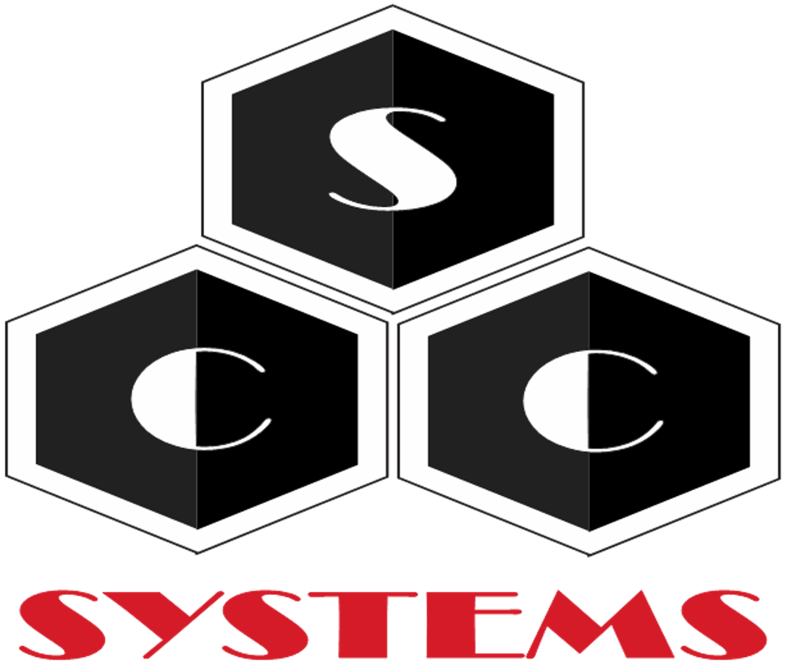
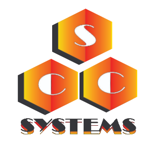

# Marca

## Variações

## Objetivo

O objetivo da IDENTIDADE VISUAL é normatizar e padronizar os aspectos visuais de formulários para documentação, templates, telas do programa, enfim, todos os
aspectos do design e de usabilidade das peças que envolvem o projeto(Formulários,
interfaces, telas, documentos, entre outros).

## Identidade

Com a ideia do saco de carvão na cabeça, analisamos sua definição e suas características a fim de fazer uma analogia com a nossa proposta:

O carvão mineral era utilizado para impulsionar o funcionamento das máquinas a vapor. Uma “FONTE DE ENERGIA” para a transformação do futuro!

[Identidade Visual Completa](./IdentidadeVisual.pdf)
